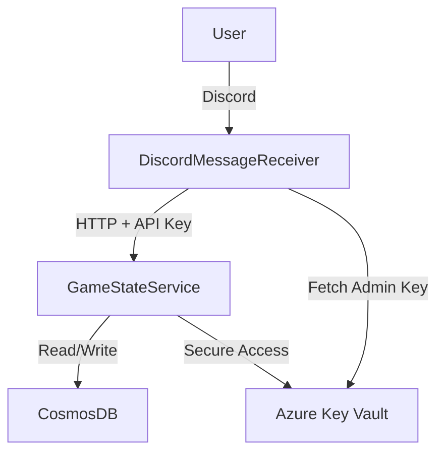

# Discord RPG - Cloud Native Game Server System

This is a **cloud-native, modular turn-based RPG server system**  
built for Discord using **.NET 8**, **Azure**, and modern backend practices.

---

## How to Play (Try the Game!)

1. **[Invite the RPG Bot to your Discord Server](https://discord.gg/YOUR_INVITE_LINK)**  
2. Type `/start` in the server  
3. The bot will send a DM to begin your adventure!

> The entire game is played via **Discord DMs**.
> No installation, no accounts — just play.

---

The system is split into two microservices:

1. `DiscordMessageReceiver` – Handles Discord bot commands & user input
2. `GameStateService` – Stores and processes game logic, combat, and state

All communication between services is done via **HTTP + API Key authentication**  
with **in-memory caching**, **Key Vault integration**, and **full observability** via **OpenTelemetry**.

---

##  Architecture Overview

---

## Tech Stack

| Layer | Tech |
|------|------|
| **Language** | .NET 8 (C#) |
| **Bot Framework** | Discord.NET |
| **HTTP Communication** | HttpClient |
| **Cloud Platform** | Azure Container Apps |
| **Database** | Azure Cosmos DB (NoSQL) |
| **Secrets Management** | Azure Key Vault |
| **Authentication** | API Key + In-Memory Cache |
| **CI/CD** | GitHub Actions |
| **Observability** | OpenTelemetry (Tracing & Logging) |

---

## Authentication System

### Admin Flow (Key Issuance)
- Discord service pulls a **permanent admin key** from Azure Key Vault
- This is used only to request short-lived **game API keys**
- These are stored in **in-memory cache** and refreshed on expiration

### Game API Flow
- Incoming HTTP requests to game service are authenticated via API Key header
- Middleware checks:
  - Is key in local memory cache?
  - If not → Pull from Key Vault and cache it
  - If invalid or expired → Return `403 Forbidden`

---

##  Features

- Full text-based RPG playable through **Discord**
- Commands support both **prefix (`!menu`, `!help`)** and **slash commands (`/start`)**
- Game session & state are persisted in **Cosmos DB**, with caching in memory
- Combat, movement, map traversal and more
- Rich **embedded messages** with status, stats, monsters, rewards
- Minimal latency via **cache-first reads**, writes only on save

---

## Deployment

Both services are deployed independently as containerized applications:

### DiscordMessageReceiver

- Deployed as Azure Container App
- Uses `minReplicas: 1` to remain Always On
- Receives Discord Gateway messages (WebSocket)

### GameStateService

- Stateless service hosted on Azure
- Only persists data to Cosmos DB
- Optimized for fast read/write performance

### CI/CD via GitHub Actions

- Build → Docker Image → Push to Azure Container Registry
- No auto-deploy; manual `az containerapp update` used for rollout

---

## Troubleshooting Summary

| Problem | Resolution |
|--------|------------|
| Azure Container App auto shutdown | Set `minReplicas: 1` to keep Discord service alive |
| Key Vault latency (200–300ms) | Cached all secrets in memory → 1–2ms |
| Secure multi-service API auth | Implemented full API Key flow w/ cache & Key Vault |
| Cosmos DB read overhead | Used in-memory cache for gameplay state, wrote only on save |

---

## Sample Commands

| Command | Description |
|--------|-------------|
| `!menu` | Begin new game or continue saved state |
| `!save` | Save current progress |
| `/start` | Slash command to start the adventure (sends DM) |

 All gameplay takes place in **DMs** for a private RPG experience.

---

## Design Philosophy

- Fast: Optimized performance using memory-first reads
- Secure: API Key, secrets isolation via Key Vault
- Scalable: Stateless containers & modular architecture
- Simple: Only use necessary infra, no overengineering
- Transparent: Every interaction is traceable via OpenTelemetry

---

## Author

Developed solo by [@vbn930](https://github.com/vbn930) in 2 weeks  
as a **cloud systems design project**, combining full-stack backend, API design, and game logic engineering.
